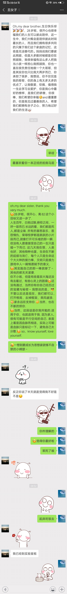

# day047
Merry Chirstmas.

吃饭,早起,读诗,读英语.

读了培根的英文文章,古英语真是有意思. 短句,很有节奏,也可能是培根的文风如此,我不懂唉.

今天生日,生日快乐.

妹妹发来的贺信:

Oh,my dear brother,生日快乐呀，28岁啦，很开心也很幸福我们的人生可以彼此陪伴，这一生中，我们大概会是陪伴彼此时间最长的人，而且我们拥有很多共同的只属于我们这个家庭的记忆，这些是无法替代的。妈妈说我们要彼此照顾，但是大多数时候都是你在照顾我，我很幸福有这么多人把我当小孩一样担心我照顾：我，你也一直在很负责任地做一个大哥哥，但是其实你也只比我大两岁而已，你承担了很多，我想说，你不仅仅是我的哥哥，你的身上有太多太多的优点了，让我敬爱，钦佩，值得我一生去学习去爱护，你是我心中最好的榜样，是我们的骄傲，你很棒，我们希望你幸福and最重要的，你是我见过最善良的人，希望我们都拥有赤子之心，努力地过好我们的生活[小狗]

我的回复:

oh,my dear sister, thank you very much.
28岁啦，很开心，离82这个小目标又进一步了.
人生百年，白驹过隙,俯仰之间，一呼一吸而已.长远的看，我们都是死人,都是尘埃. 所有的喜怒哀乐，恩怨情仇，荣辱惊梦都是跳跃的小片段而已,就像打开可乐嗞的那一瞬. 但没有人愿意接受自己的一生只是嗞一下而已. 这几天我在想，人类也好，其他物种也罢，生命在不断的延续与消亡，每个人只是生命这个大火种的接力棒，文明只是接力游戏中人一厢情愿赋予的意义.
其实跑自己的那一棒就够了~ 其他的都无关紧要.
你不小啦，但是有些星辰大海还没有去看过，有些心灵上的困境还没有遇过，当然你有你自己经历过的宝藏与秘密~ 我想说的是，不管以后还是现在，我们都可以，打开格局，去掉框架，乘风破浪. 家永远在支持你.当然，也在不断的烦你.
当然，这段话是你我共勉的.适用于你，也就适用于我. 因为家人,很有可能是平行空间的自己. 表面上看是因血脉而相连，实际上可能是血脉只是标记一下，避免自己太分散. so，know yourself, love yourself.

## 哈哈哈

